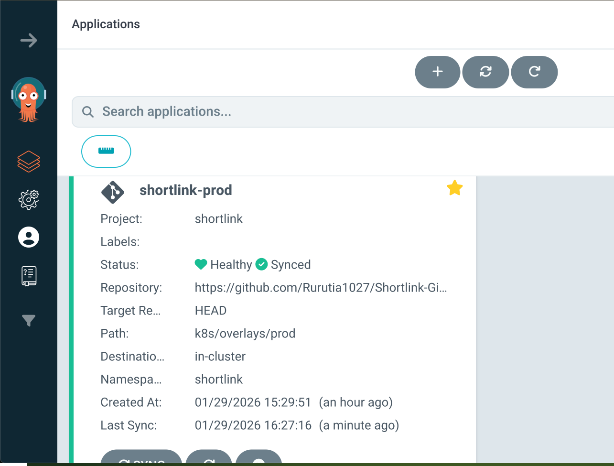
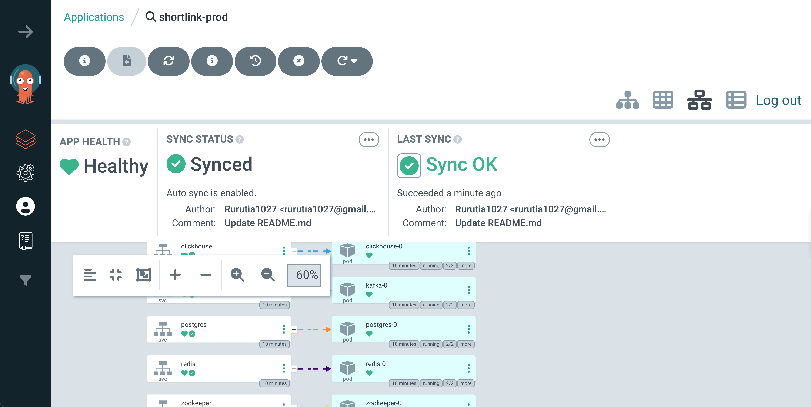

## Shortlink GitOps | [](https://github.com/Rurutia1027/Shortlink-GitOps/actions/workflows/ci-k8s-validate.yml)

This folder is the **GitOps / ArgoCD repository** for the ShortLink platform.

### ArgoCD vs Kustomize (do not mix)

- **ArgoCD** is **prod-only**: it watches this Git repo and syncs `k8s/overlays/prod` to the cluster. Do **not** run `kubectl apply -k k8s/overlays/prod` when ArgoCD is in use.
- **Kustomize** (local): use `kubectl apply -k k8s/overlays/dev` for local dev; prod is either manual apply (no ArgoCD) or managed by ArgoCD.

### Environments

- **dev**: middleware only (namespace + postgres + redis + kafka + clickhouse). Apply locally: `kubectl apply -k k8s/overlays/dev`.
- **prod**: middleware + apps (admin + shortlink + istio). When ArgoCD is used, ArgoCD syncs from Git; otherwise apply locally: `kubectl apply -k k8s/overlays/prod`.

### Layout

- `k8s/`: Kustomize base and overlays (dev / prod)
- `argocd/`: ArgoCD `AppProject` + `Application` (prod)
- `bin/`: Scripts to install ArgoCD and register prod app (see `docs/argocd-启动指南.md`)

### Start ArgoCD (prod-only, UI on port 8088)

```bash
./bin/argocd-install.sh
./bin/argocd-port-forward.sh   # open http://localhost:8088
export GIT_REPO_URL=https://github.com/Rurutia1027/Shortlink-GitOps.git
./bin/argocd-register-prod.sh
```

## Diagrams of ArgoCD UI 


